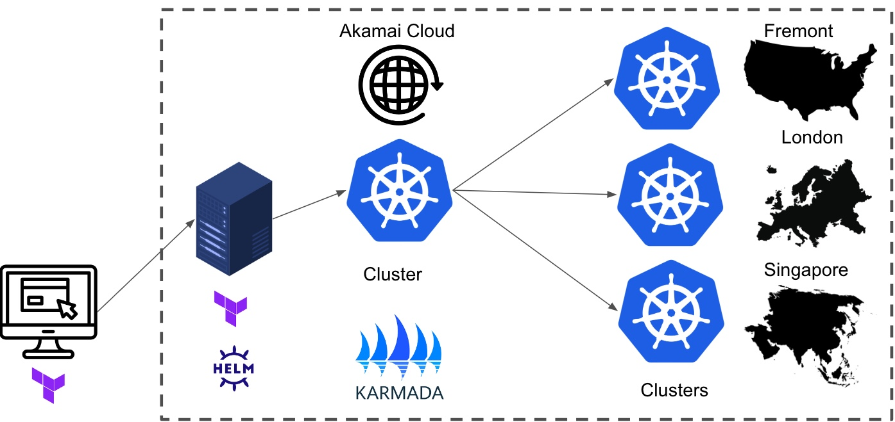
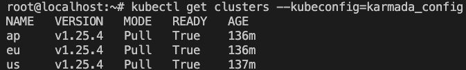

MultiCluster MultiRegion with LKE and Karmada.
======================

## Overview and High level explanation

The main idea of this setup is to provide an easy to manage multiregion kubernetes cluster setup on Akamai Cloud (Linode), with the Linode Kubernetes Engine (LKE).


Requirements:

A laptop or workstation or vm with terraform and git installed.
Linode account with a valid api token with access to Linodes and LKE.


The general steps to be performed are:

### 1- From a local/remote workstation or laptop, trigger a terraform template that will create the following:  

--A simple Linode instance from which we will manage the clusters. It does some hardening as disabling ssh root login and creating a custom user name k8s_admin with sudo access. Some generic ssh keys are included, however it is strongly recommended to setup your own. It will install kubectl, terraform, helm and karmada chart.  

--LKE cluster manager that will manage 3 cluster on 3 diferent regions, this one will be on us-west.  

--3 LKE agent clusters that will be the ones in which we will directly setup our workloads, each on a different region: us-west, eu-west and ap-south.  

--Some preparation for the Karmada setup.  

### 2- Setup everything related to karmada to start managing the clusters.

### 3- Deploy a karmada policy and a sample deployment/service.


## What is Karmada?

Karmada is a sandbox project of the Cloud Native Computing Foundation (CNCF) that enables you to run your cloud-native applications across multiple Kubernetes clusters and clouds, with no changes to your applications. By speaking Kubernetes-native APIs and providing advanced scheduling capabilities, Karmada enables truly open, multi-cloud Kubernetes.

https://github.com/karmada-io/karmada


## A reference diagram of what you would end up with



-----

## Detailed steps

### 1-Deploying the linode to manage the clusters as well the clusters.

Clone this repo:

```bash
git clone https://github.com/jcotoBan/LKarmada.git
```

Look for folder named instancetf, and add your root password and Linode API token to the instance.tfvars file.

Then, look for folder scripts and on line 42 of the instance.sh file add your Linode API token. 

As stated earlier, on ssh-keys folder you will find generic ssh-keys, you can replace them with your own. Just make sure they are in the same location and they are named workshopK and workshopK.pub

If change the name or the location, make sure to update workshop_key resource on instance.tf file (lines 51 to 54).

Finally, making sure your are inside of instancetf folder, run the following command:

```bash
terraform apply -var-file="instance.tfvars"
```

Wait some time until your instance and all the clusters are created.

### 2-Setting up karmada

First, login to your Linode instance. Look for the IP address of the instance labeled as "workshopInstance".  

Then, to login, issue the following command:

```bash
ssh -i ../ssh-keys/workshopK k8s_admin@<your linode IP>
```

From there, proceed to login as root and then go to the root home path:

```bash
sudo su
```

```bash
cd ~
```
The first Karmada component we are going to install is the karmada server/manager. By using helm we will install the karmada chart on our region_manager_lke_cluster, it will be created with specific values, more important ones:

--namespace: karmada-system, in which the related objects will reside.  
--service type and port: NodePort and port will be 32443, which means it will be make available on each worker node public ip on that specific port.  
--certs.auto.hosts[6]: As part of the setup, we need to pass the public ip of the node where the chart resides, in this case a file that was prepared during the first part of this setup.

```bash
helm install karmada karmada-charts/karmada \
--kubeconfig=kubeconfig_cluster_manager.yaml \
--create-namespace --namespace karmada-system \
--version=1.2.0 \
--set apiServer.hostNetwork=false \
--set apiServer.serviceType=NodePort \
--set apiServer.nodePort=32443 \
--set certs.auto.hosts[0]="kubernetes.default.svc" \
--set certs.auto.hosts[1]="*.etcd.karmada-system.svc.cluster.local" \
--set certs.auto.hosts[2]="*.karmada-system.svc.cluster.local" \
--set certs.auto.hosts[3]="*.karmada-system.svc" \
--set certs.auto.hosts[4]="localhost" \
--set certs.auto.hosts[5]="127.0.0.1" \
--set certs.auto.hosts[6]=$(cat kcip.txt)
```

Then, we will retrieve the kubeconfig file through which we will manage our clusters:

```bash
kubectl get secret karmada-kubeconfig \
 --kubeconfig=kubeconfig_cluster_manager.yaml \
 -n karmada-system \
 -o jsonpath={.data.kubeconfig} | base64 -d > karmada_config
```

We need to do a slight change on that file, just run:

```bash
 sed -i "s|https://karmada-apiserver.karmada-system.svc.cluster.local:5443|https://$(cat kcip.txt):32443|g" karmada_config
```

To add each cluster as a karmada agent, we need the certificates of the karmada manager, with this command we will get them:

```bash
kubectl config view --kubeconfig=karmada_config --minify --raw --output 'jsonpath={..cluster.certificate-authority-data}' | base64 -d > caCrt.pem
kubectl config view --kubeconfig=karmada_config --minify --raw --output 'jsonpath={..user.client-certificate-data}' | base64 -d > crt.pem
kubectl config view --kubeconfig=karmada_config --minify --raw --output 'jsonpath={..user.client-key-data}' | base64 -d > key.pem
```

The following command will add the certificate values to a yaml file called values.yaml, as it is the only way to pass the certificates to the agent chart installation without issues:

```bash
echo "agent:" >> values.yaml && \
echo "  kubeconfig:" >> values.yaml && \
echo "    caCrt: |" >> values.yaml && \
cat caCrt.pem | sed 's/^/      /' >> values.yaml && \
echo "    crt: |" >> values.yaml && \
cat crt.pem | sed 's/^/      /' >> values.yaml && \
echo "    key: |" >> values.yaml && \
cat key.pem | sed 's/^/      /' >> values.yaml
```

Then, we will actually install the agent on each of the clusters. This will allow our karmada manager to start the management of our clusters. We will have to run the command for each of the 3 clusters:

```bash
helm install karmada karmada-charts/karmada \
--kubeconfig=kubeconfig_us.yaml \
--create-namespace --namespace karmada-system \
--version=1.2.0 \
--set installMode=agent \
--set agent.clusterName=us \
--set agent.kubeconfig.server="https://$(cat kcip.txt):32443" \
--values values.yaml
```

```bash
helm install karmada karmada-charts/karmada \
--kubeconfig=kubeconfig_eu.yaml \
--create-namespace --namespace karmada-system \
--version=1.2.0 \
--set installMode=agent \
--set agent.clusterName=eu \
--set agent.kubeconfig.server="https://$(cat kcip.txt):32443" \
--values values.yaml
```

```bash
helm install karmada karmada-charts/karmada \
--kubeconfig=kubeconfig_ap.yaml \
--create-namespace --namespace karmada-system \
--version=1.2.0 \
--set installMode=agent \
--set agent.clusterName=ap \
--set agent.kubeconfig.server="https://$(cat kcip.txt):32443" \
--values values.yaml
```

If everything was followed correctly, at this point you should be able to see the clusters listed from the karmada server:

```bash
kubectl get clusters --kubeconfig=karmada_config
```




Since the certs file have decoded sensitive data, make sure you erase them:

```bash
rm caCrt.pem
rm crt.pem
rm crt.pem
rm values.yaml
```

Then, we will deploy a Sample app to our cluster!

In order to be able to deploy apps through karmada, we require a policy object that dictates how the deployments will be performed across the clusters.  
For the purpose of this setup, a generic file to split the workload across all clusters was created. Of course, you can fully customize it to suit your needs. Basically is how the replicas of the deployment will be distributed.  

If you change it to use your custom deployment, just make sure the resource selectors are correctly set:

```yaml

resourceSelectors:
   - apiVersion: apps/v1
     kind: Deployment
     name: protoapp
   - apiVersion: v1
     kind: Service
     name: protoappsvc
```

Then, just issue the following command:

```bash
kubectl apply -f clusterstf/karmadaManifests/policy.yaml --kubeconfig=karmada_config

```
And finally, to get our custom app deployed, just run:

```bash
kubectl apply -f clusterstf/deploymentManifests/protoapp.yaml --kubeconfig=karmada_config
```


